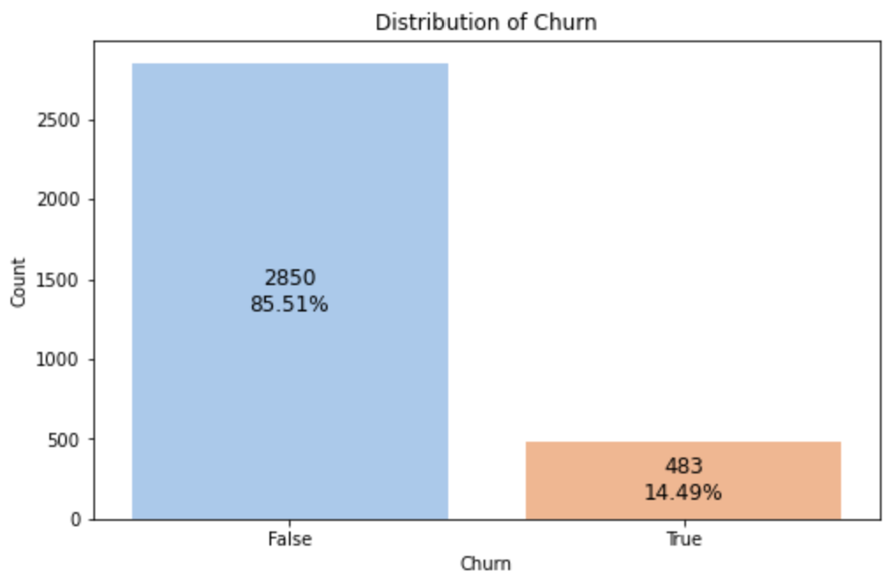
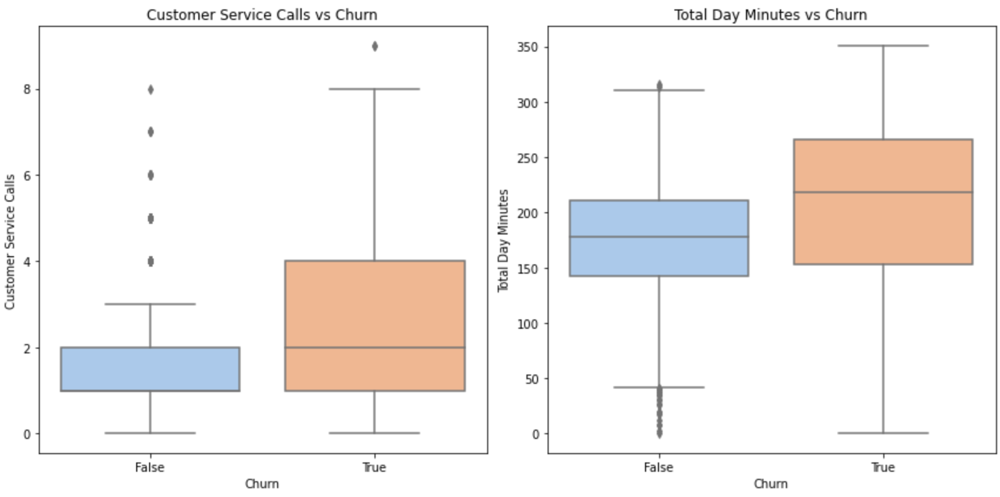
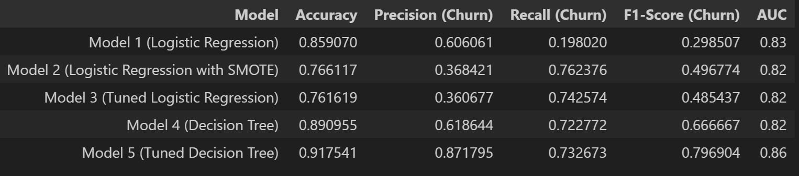
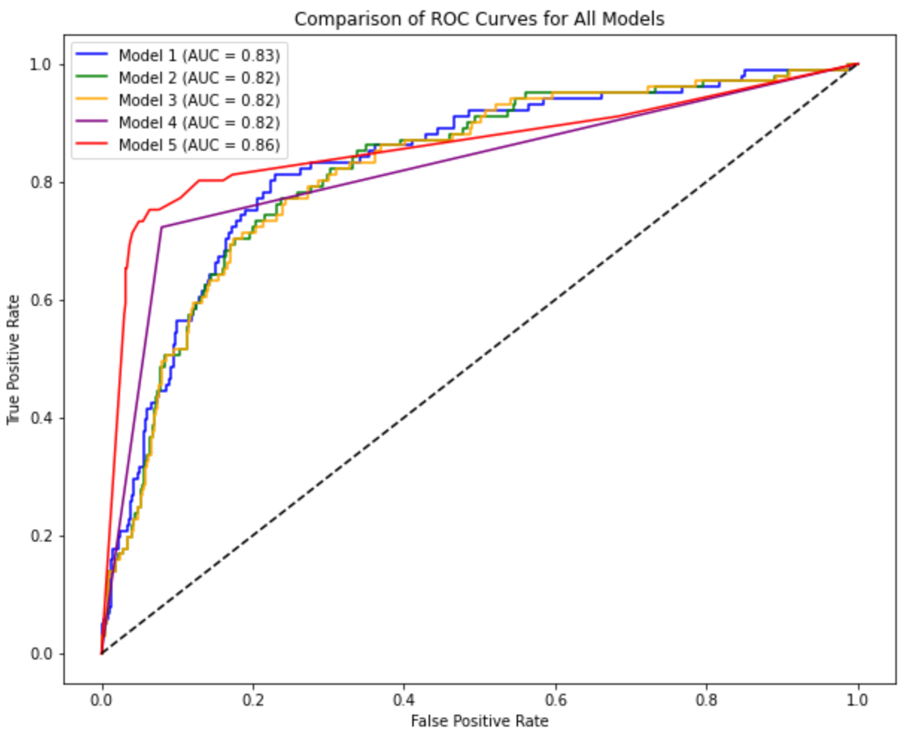
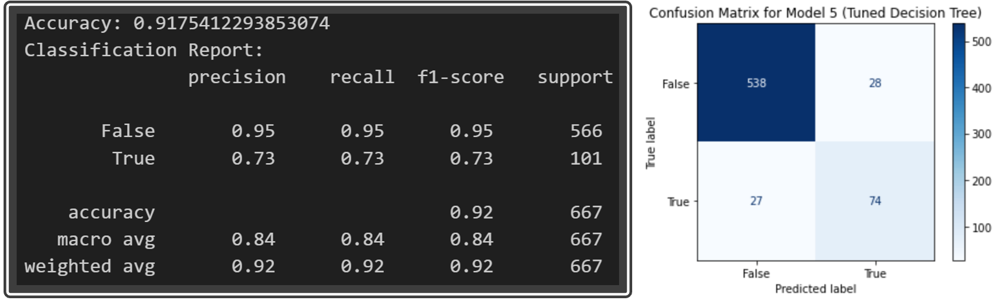
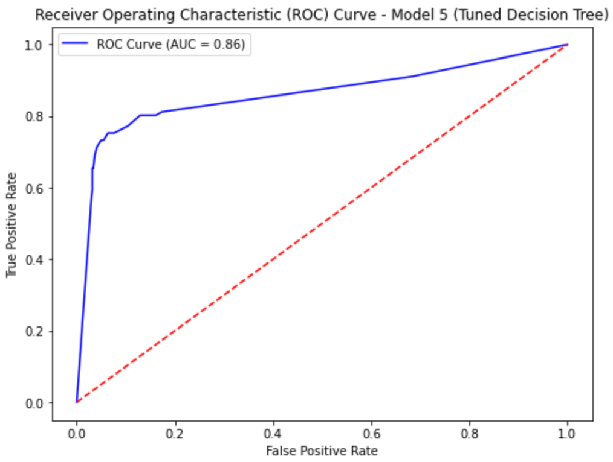

# SyriaTel Customer Churn Modeling Project

**Author:** Joseph Ngige

## Project Overview

The goal of this project is to build a classification model that predicts whether a customer will soon stop doing business with SyriaTel, a telecommunications company, in order to help SyriaTel reduce churn by identifying at-risk customers and implementing targeted retention strategies. By developing a predictive model based on customer data, the project aims to classify whether a customer is likely to churn, providing valuable insights to SyriaTel's business stakeholders who are focused on minimizing customer churn to reduce revenue loss. The outcome of this project enables SyriaTel to identify at-risk customers and take proactive measures to retain them, ultimately supporting the company's efforts to maintain customer loyalty and improve profitability. Specifically, the outcome indicated that SyriaTel should:

1. Deploy Model 5 (Tuned Decision Tree) and implement targeted retention efforts for customers that are likely to churn i.e.;

    * Establish plans for high usage customers,
    * Improve International Service,
    * Enhance customer service and
    * Implement region specific approach.

2. Monitor and Refine the Model to ensure continued effectiveness, and
3. Explore Ensemble Methods to potentially improve model performance.

## Business Understanding

Customer churn is a critical issue for telecommunications companies like SyriaTel, as high churn rates lead to significant revenue loss and increased customer acquisition costs. In the telecommunications industry, where customer retention directly impacts revenue, minimizing churn is essential. The business objective is to identify patterns in customer behavior that signal an impending departure and predict churn, enabling SyriaTel to proactively engage at-risk customers with targeted retention offers. By focusing retention efforts on customers who are likely to leave, SyriaTel can optimize its marketing strategies and customer support resources, ultimately improving profitability and sustaining customer loyalty.

## Data Understanding

The curated dataset provided contains information about SyriaTel customers and includes features related to customer behavior, demographics, and service usage. The dataset consists of 3,333 entries and 21 columns with features such as account length, international plan, total day minutes, and customer service calls. The target variable is binary, indicating whether a customer has churned (True) or not (False). The dataset encompasses both numerical and categorical features, providing a comprehensive foundation for building a predictive model to identify at-risk customers.

## Data Analysis & Preparation

The data preparation process began with an Exploratory Data Analysis (EDA) to examine the features, target variable, and their relationships. This analysis revealed an imbalance in the churn class, with significantly fewer customers labeled as churned (14.49%). The imbalance would need to be addressed through appropriate techniques during modeling to check if it improves model performance. It also highlighted key trends, such as the strong correlation between high daytime usage, frequent customer service calls, and increased churn likelihood. Gradual decline from the highest to the lowest churn rates indicated that there is significant variation in churn across different states.

***Figure 1: Churn Countplot***



*The count plot shows that the dataset is imbalanced, with fewer customers labeled as churned (483) compared to those who did not churn (2,850).*

***Figure 2: Churn Boxplot***



*The boxplot reveals that customers who churn tend to have a higher median customer service calls and total day minutes usage.*

Based on the insights, irrelevant and redundant columns were removed, including phone number, area code, and various charge and call-related features, to prevent multicollinearity and enhance model accuracy. The dataset was then split into training and test sets (80:20) before data preprocessing to avoid data leakage. Categorical variables were transformed to numerical variables to ensure that all features were represented in a way that would maximize model's predictive power.

## Modeling

An iterative modeling approach was employed, starting with basic models and gradually increasing complexity to enhance performance. The initial model, a simple Logistic Regression, struggled to accurately identify customers likely to churn, prompting the application of the Synthetic Minority Over-sampling Technique (SMOTE) in Model 2 to address churn class imbalance. This significantly improved the model’s ability to detect churners, a crucial factor for business decision-making, though it introduced more false positives (customers that the model predicts will leave, but in reality stay). Subsequent models (Models 3, 4 & 5) focused on adjusting model rules and exploring alternative algorithms, such as Decision Trees, to further refine predictions.

In Model 3, tuning focused on refining the Logistic Regression model by adjusting hyperparameters to enhance its performance. The key adjustments included finding the optimal regularization strength (`C`), which balances the model’s ability to fit the training data while avoiding overfitting. Additionally, the type of penalization (`l1` or `l2`) was selected to determine how the model simplifies itself by minimizing less important features, helping it generalize better to new data. In Model 5, the Decision Tree model was fine-tuned by controlling its complexity through hyperparameters like `max_depth`, which limits how deep the tree can grow, and `min_samples_split` and `min_samples_leaf`, which ensure that each decision is based on enough data. These adjustments helped Model 5 achieve a better balance between accuracy and robustness, making it the best-performing model.

## Evaluation

The evaluation focused on comparing key metrics like Accuracy, Precision, Recall, F1-Score, and the Area Under the ROC Curve (AUC) to determine the best model for predicting customer churn. While Accuracy provides an overall measure of correct predictions, it can be misleading in imbalanced datasets. Thus, Recall was prioritized as it is crucial for identifying most customers who are likely to churn, while Precision ensures accuracy in those predictions. The F1-Score offers a balanced measure of Precision and Recall, and AUC indicates the model’s ability to distinguish between churners and non-churners.

***Figure 3: Model Score Summary***





After iteratively testing and refining several models, the Tuned Decision Tree (Model 5) emerged as the best performer. By effectively balancing complex, non-linear relationships in the data, and through careful model rules tuning, Model 5 achieved the highest accuracy (91.75%) and AUC score (86%). This model excelled in identifying churners with a Recall of 72.28% and a Precision of 87.15%, making it the most reliable tool for predicting customer churn and supporting SyriaTel's customer retention strategies.

***Figure 4: Model 5 Scores***





## Conclusion

The analysis and modeling conducted in this project have successfully identified an optimal approach for predicting customer churn for SyriaTel. The deployment of Model 5 can have a significant impact on SyriaTel’s customer retention strategies. By accurately identifying customers at risk of churning, SyriaTel can tailor its marketing and customer service efforts to these individuals, offering targeted incentives or personalized service improvements to retain them. This targeted approach not only helps in reducing customer turnover but also optimizes resource allocation, boost loyalty, and increase long-term revenue.

### Recommendations & Next Steps:

* **Implement Targeted Retention Campaigns:** Use the model to identify high-risk customers and target them with personalized offers, such as discounts, service upgrades, or exclusive support. Specifically, SyriaTel should:
    1. **Establish Plans for High Usage Customers:** Offer personalized or discounted plans to retain high day-minute users.
    2. **Improve International Service:** Provide more competitive international plans or enhance call quality for customers with high international usage.
    3. **Enhance Customer Service:** Improve interactions, especially for frequent callers, to reduce churn.
    4. **Implement Region-Specific Approach:** Focus retention efforts on high-churn states with tailored strategies, while maintaining satisfaction in low-churn states.

* **Monitor and Refine the Model:** Regularly monitor and retrain the model with new data to adapt to changing customer behavior. Consider incorporating customer feedback and service interaction data for better predictions.

* **Explore Ensemble Methods:** Investigate ensemble methods like Random Forest or Gradient Boosting to potentially improve recall and overall model robustness.


## For More Information

See the full analysis in the [Jupyter Notebook](./index.ipynb) or review this [Presentation](./presentation.pdf).

For additional info, contact Joseph Ngige at [elngige@gmail.com](mailto:elngige@gmail.com)

## Repository Structure

```
├── README.md                                                 <- Top-level README for reviewers of this project
├── index.ipynb                                               <- Narrative documentation of analysis in Jupyter notebook
├── presentation.pdf                                          <- PDF version of project presentation
├── jupyter_notebook.pdf                                      <- PDF version of the index.ipynb
├── churn_data.csv                                            <- SyriaTel customer churn data sourced externally
└── images                                                    <- Sourced externally and generated from code
```